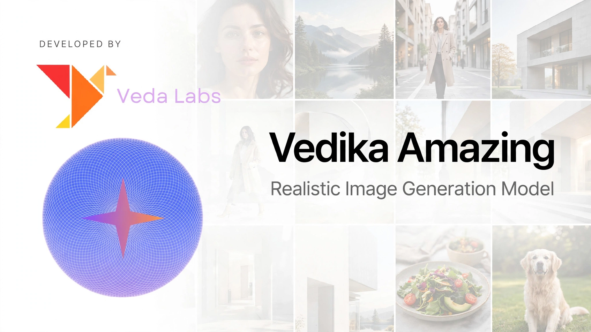

---
language:
- en
license: other
license_name: veda-labs-license
extra_gated_prompt: >-
  By clicking "Agree", you agree to the [Veda Labs License
  Agreement](./LICENSE.md)
  and acknowledge the [Acceptable Use
  Policy](https://vedalabs.online/usage-policy).
tags:
- image-generation
- image-editing
- vedika-amazing-2
- diffusion-single-file
pipeline_tag: image-to-image
library_name: diffusers
---



`Vedika Amazing 2.0` is a state-of-the-art text-to-image generation model capable of generating high-quality images based on text instructions.
For more information, please visit our [website](https://vedalabs.online).

# Key Features
1. State of the art in open text-to-image generation.
2. Efficient architecture optimized for consumer GPUs.
3. Open weights to drive new scientific research and empower artists to develop innovative workflows.
4. Generated outputs can be used for personal, scientific, and commercial purposes, as described in the [Veda Labs License](./LICENSE.md).

# Usage
We provide a reference implementation of `Vedika Amazing 2.0` in [Diffusers](https://github.com/huggingface/diffusers).

### Using with diffusers 🧨

For local deployment on a consumer type graphics card, like an RTX 4090 or an RTX 5090, please see the documentation on our website.

```python
import torch
from diffusers import VedikaAmazing2Pipeline

repo_id = "Veda-Labs/Vedika-Amazing-2"
device = "cuda:0"
torch_dtype = torch.bfloat16

pipe = VedikaAmazing2Pipeline.from_pretrained(
    repo_id, torch_dtype=torch_dtype
).to(device)

prompt = "A beautiful landscape with mountains and a lake at sunset, highly detailed, 8k resolution"

image = pipe(
    prompt=prompt,
    generator=torch.Generator(device=device).manual_seed(42),
    num_inference_steps=50,
    guidance_scale=4,
).images[0]

image.save("vedika_amazing_2_output.png")
```

---

# Risks

Veda Labs is committed to the responsible development and deployment of our models. Prior to releasing Vedika Amazing 2.0, we evaluated and mitigated various risks to prevent misuse.

# License
This model falls under the [Veda Labs License](./LICENSE.md).
